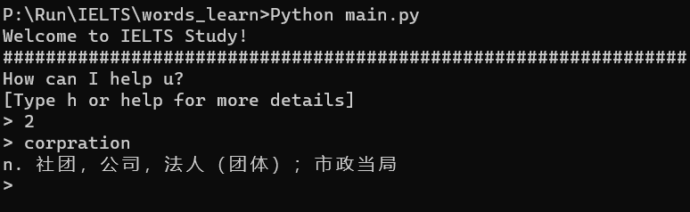

# ielts_tools version 1.1
---
**Author:**&nbsp;&nbsp;***Chris Chen***

**Contact:**&nbsp;&nbsp;***chrischanyedu@gmail.com***

**Github:**&nbsp;&nbsp;***https://github.com/ChrisChen0904CY***

**Release Date:**&nbsp;&nbsp;***8/25/2023***

# Menu
---
<a href="#1">1. Brief Introduction</a><br><br>
&nbsp;&nbsp;&nbsp;&nbsp;<a href="#1.1">1.1 What's this for</a><br><br>
&nbsp;&nbsp;&nbsp;&nbsp;<a href="#1.2">1.2 How this work</a><br><br>
&nbsp;&nbsp;&nbsp;&nbsp;<a href="#1.3">1.3 Basement</a><br><br>
<a href="#2">2. Related File Structure</a><br><br>
<a href="#3">3. Revelant Packages</a><br><br>
<a href="#4">4. How to Use</a><br><br>
&nbsp;&nbsp;&nbsp;&nbsp;<a href="#4.1">4.1 Statement of the core Class</a><br><br>
&nbsp;&nbsp;&nbsp;&nbsp;&nbsp;&nbsp;&nbsp;&nbsp;<a href="#4.1.1">4.1.1 Initialize</a><br><br>
&nbsp;&nbsp;&nbsp;&nbsp;&nbsp;&nbsp;&nbsp;&nbsp;<a href="#4.1.2">4.1.2 Dictation Function</a><br><br>
&nbsp;&nbsp;&nbsp;&nbsp;&nbsp;&nbsp;&nbsp;&nbsp;<a href="#4.1.3">4.1.3 Reading-Tese Function</a><br><br>
&nbsp;&nbsp;&nbsp;&nbsp;&nbsp;&nbsp;&nbsp;&nbsp;<a href="#4.1.4">4.1.4 Inquire about a Word Quickly</a><br><br>
&nbsp;&nbsp;&nbsp;&nbsp;&nbsp;&nbsp;&nbsp;&nbsp;<a href="#4.1.5">4.1.5 Test Function</a><br><br>
&nbsp;&nbsp;&nbsp;&nbsp;<a href="#4.2">4.2 Deal with Phrases</a><br><br>
<a href="#5">5. Easily Use</a><br><br>
<a href="#6">6. Update Details</a><br><br>
&nbsp;&nbsp;&nbsp;&nbsp;<a href="#6.1">6.1 version 1.1</a><br><br>
<a href="#7">7. Thanks</a><br><br>

<h1 id="1">Brief Introduction</h1>

<h2 id="1.1">What's this for</h2>

This package is designed to aid ***IELTS exam*** preparation, with a specific focus on ***enhancing dictation skills*** and ***expanding vocabulary***.

<h2 id="1.2">How this work</h2>

You can include words that ***are frequently misspelled***, ***lead to confusion while listening***, or ***prove challenging to comprehend*** in the list files. Subsequently, you can run the `main.py` file provided in this context.

Then you have the option to select either a `'dictation'` or a `'reading test'` as illustrated below:


Here's an instance for the ***reading test***:


<h2 id="1.3">Basement</h2>

The entire project, or rather, the package, relies on the utilization of the ***youdao API***. Consequently, this package may become non-functional when the youdao API be discontinued.

<h1 id="2">Related File Structure</h1>

To ensure the program can run correctly, it is advisable to structure your files as follows:

├─audios<br>
│  ├─UK<br>
│  └─US<br>
├─dictation_list.txt<br>
├─read_list.txt<br>
├─meanings.txt<br>
├─ielts_tools.py<br>
├─main.py<br>

<h1 id="3">Revelant Packages</h1>

To ensure this package functions as intended, you should verify whether you have installed the following packages:
> urlib
> json
> playsound

If not, you can copy the respective command here for installation:

**1. urlib**
```python
pip install urlib
```

**2. json**
```python
pip install json
```

**3. playsound**
```python
pip install playsound
```

<h1 id="4">How to Use</h1>

Here is ***the most significant section*** of this file. Perhaps you navigated directly to this part upon opening the file. While it is easily understandable, you may overlook some intriguing terms along the way.

<h2 id="4.1">Statement of the core Class</h2>

As you can observe, the sole component within this package is a class named ***WordTrainer***. Much like its namesake, isn't it?

Alright, let me walk you through the core components step by step:

<h3 id="4.1.1">Initialize</h3>

You can never prepare a meal without a pot, can you? Similarly, if you wish to utilize this for exercises, you must initialize it as follows:

```python
UK_Trainer = WordTrainer(1)
```

It specifies that you create an object with an ***English Accent***, which is commonly used in IELTS.

The only parameter you can provide during initialization is either the number *0* or *1*. *0* corresponds to an ***American Accent***, while *1* corresponds to an ***English Accent***.

<h3 id="4.1.2">Dictation Function</h3>

**Caution: It's already been abandon since version 1.1, and it's been replace with test function.**

After initializing an object, you can invoke the dictation function to undergo a personalized dictation, as illustrated below (assuming your object is named *UK_Trainer*):

```python
# 10 here refers to the batch size of the test and can be any positive number you like
UK_Trainer.dic_test(10)
```

***Tips.*** There are certain audio segments that cannot be played, and for these words, you do not need to spell them; they will be skipped as the follwing:


<h3 id="4.1.3">Reading-Test Function</h3>

**Caution: It's already been abandon since version 1.1, and it's been replace with test function.**

After initializing an object, you can invoke the dictation function to undergo a personalized read test, as illustrated below (assuming your object is named *UK_Trainer*):

```python
# 10 here refers to the batch size of the test and can be any positive number you like
UK_Trainer.unknow_test(10)
```
<h3 id="4.1.4">Inquire about a Word Quickly</h3>

You can also simply request the definition of a specific word using this method:

```python
# good here can be replaced to any word you want to ask
UK_Trainer.showInfo('good')
```
***Tips.*** When the word you inquire about is not found in the current file, it will be downloaded to the ***read_list.txt***, and its definitions will be printed.

<h3 id="4.1.5">Test Function</h3>

It provided with three parameters said `batch_size`, `mode` and  `write_meanings`.

First of all, you can input any positive number or the text 'all' for the `batch_size` to speicifies how many words you'd like to take.

Secondly, you can choose `mode` as *0* for *dictation* and *1* for *reading test*.

Ultimately, `write_meanings` is a bool-type parameter which spicifies whether you want a meaning write exercise as an addition through your dictation.

e.g. Have a normal dictation with 10 words per epoch:
```python
# good here can be replaced to any word you want to ask
UK_Trainer.test(10, 0, False)
# It's also feasible to ignore the last two parameters because of default value like:
UK_Trainer.test(10)
```

e.g. Have a dictation with 10 words per epoch and a meaning write in addtion:
```python
# good here can be replaced to any word you want to ask
UK_Trainer.test(10, 0, True)
```

e.g. Have a reading test with 10 words per epoch:
```python
# good here can be replaced to any word you want to ask
UK_Trainer.test(10, 1) # Here the last parameter dosen't impact on the process
```

<h2 id="4.2">Deal with Phrases</h2>

When you need to request the meaning of a phrase or add a phrase to your list, you ***must*** replace the ***spaces*** between words with a plus symbol +.

Here's an instance for you:

The phrase `"pin down"` should be written as `"pin+down"`.


**`However, you should disregard this rule when participating in dictation exercises. For instance, you should simply type 'pin down' when you hear it insteadd of 'pin+down'.`**

<h1 id="5">Easily Use</h1>

If you prefer a quick and convenient use of this package, you can just run the code provided below, and you will obtain the same results I have demonstrated above:

```python
from ielts_tools import WordTrainer


# GEt the batch size of training
def batch_input():
    print('OK! Now please set the batch size u\'d like to take: ')
    batch_size = input('> ')
    batch_size = 'all' if batch_size=='all' else eval(batch_size)
    return batch_size


if __name__ == "__main__":
    # Training based on UK accent
    UK_Trainer = WordTrainer(1)
    # Choose the test mode
    # 0 -- Dictation mode
    # 1 -- Reading test mode [i.e. training by typing the correct meaning of the word]
    print('Welcome to IELTS Study!')
    print("################################################################")
    mode = input('How can I help u?\n[Type h or help for more details]\n> ')
    while mode!='exit':
        # Start the test here
        if mode == '0' or 'dic' in mode:
            batch_size = batch_input()
            meaning_write = input('Would u like to write down the meanings as an extra exercise?\n[Type y to confirm]> ')
            UK_Trainer.test(batch_size, 0, meaning_write=='y')
        elif mode == '1' or 'read' in mode:
            batch_size = batch_input()
            UK_Trainer.test(batch_size, 1)
        elif mode == '2' or 'research' in mode:
            req_word = input('> ').replace(" ", "+")
            while req_word != "exit":
                UK_Trainer.showInfo(req_word)
                req_word = input('> ').replace(" ", "+")
        elif mode == 'h' or mode == 'help':
            print("################################################################")
            print("Here are all the valid commands: ")
            print("\'0\' or words contained \'dic\' ----> Have a dictation")
            print("\'1\' or words contained \'read\' ----> Have a reading-test")
            print("\'2\' or words contained \'research\' ----> Require details for a specific word")
            print("\'exit\' for quit this program")
        else:
            # When type an unexpected mode, log the information
            print("I'm not clear about your command.")
        # New Epoch Here
        print("################################################################")
        mode = input('How can I help u?\n[Type h or help for more details]\n> ')
```
Additionally, you can run this `main.py` file on your terminal for an improved experience.

```powershell
Python main.py
```

A easy and nice interact information will show to you like:


And you can type 'h' or 'help' for command list:


<h1 id="6">Update Details</h1>

<h2 id="6.1">version 1.1</h2>

**Update Date**:&nbsp;&nbsp;***8/28/2023***

**Summary:**
<ul>
	<li>Merge the function <b>dictation_test</b> and <b>reading_test</b> up to a new finction <b>test</b>.</li>
	<li>Optimze the <b>main use page</b> with the <i>indicates information</i>.</li>
	<li>Add a mode you can choose on main page to <b>require for the meanings</b> of a specific word.</li>
	<li>Add a hyrid test mode in <i>dictation</i> mode that you can choose to write down the meaning of the word after write the word itself as an addition.</li>
</ul>

**Presentation:**

**\1. Function Merge**

It's clearly shown in the `ielts_tools.py` that there are too many iterance between the dictation section and reading test section. That's why I choose to merge them up through adding a parameter to decide which test we want.

Now, here's the codes of the merged function named **test**:
```python
	# Have a test
    def test(self, batch=10, mode = 0, write_meanings=False):
        dic_length = len(self.dic if mode==0 else self.unknow_dic)
        mark = [False]*dic_length
        test_batch_len = dic_length if batch=='all' else min(dic_length, batch)
        test_list = []
        # Get all the words
        words = []
        for key in self.dic.keys() if mode==0 else self.unknow_dic.keys():
            words.append(key)
        # Generate a dictation list
        while(len(test_list)<test_batch_len):
            # Get an index first
            word_id = random.randint(0, dic_length-1)
            while(mark[word_id]):
                # Hash Random index
                word_id = 0 if word_id==dic_length-1 else word_id+1
            mark[word_id] = True
            test_list.append(words[word_id])
        # Start Test
        i = 1
        wrong_ans = []
        # initialize the mixer
        for dic_word in test_list:
            print('################################################################')
            print(str(i)+"/"+str(test_batch_len))
            right_word = self.dic[dic_word].replace('|', '\n').strip() if mode==0 else self.unknow_dic[dic_word].replace('|', '\n').strip()
            # Play the sound while dictation
            if mode==0:
                try:
                    playsound(r'.\\audios\\'+(r'US\\' if self._type==0 else r'UK\\')+dic_word+r'.mp3')
                    # Input answer
                    ans = input('> ')
                except PlaysoundException:
                    print("\033[31mThis audio can\'t play!\033[0m")
                    ans = dic_word.replace('+', ' ')
                print('\033[32mCorrect!\033[0m' if ans == dic_word.replace('+', ' ') else '\033[31mWrong Again!!!\033[0m')
            # Meaning test
            print('\033[35m'+dic_word.replace('+', ' ')+": "+'\033[0m')
            if write_meanings or mode!=0:
                input_meaning = input("What\'s the meaning of it?\n> ")
                print('\033[32mCorrect!\033[0m' if input_meaning in right_word else '\033[31mWrong Again!!!\033[0m')  
            print('Explain of it: ')
            print(right_word)
            # Check and Feedback
            judgement = ans != dic_word.replace('+', ' ') if mode==0 else input_meaning not in right_word
            if write_meanings:
                judgement = judgement or input_meaning not in right_word
            if judgement:
                wrong_ans.append(dic_word)
            # Check Whether go on
            ok = input('Go on?[y for go on] > ')
            while(ok!='y'):
                ok = input('Go on?[y for go on] > ')
            i+=1
        # Done!
        print("################################################################")
        print("Done!")
        # Compute the accuracy and review the wrong words
        print("################################################################")
        print("Acc: {:.2f}%".format(float(1-float(len(wrong_ans))/float(test_batch_len))*100))
        # review the wrong words
        # No one mistake here!
        if wrong_ans==[]:
            print('Perfect!!!')
        else:
            print('Now Let\'s review the wrong words here.')
        for j in range(len(wrong_ans)):
            print("################################################################")
            print(str(j+1)+"/"+str(len(wrong_ans)))
            print(wrong_ans[j].replace('+', ' '))
```

That's obvious the indicates section and the input section of both the **dictation test** and the **reading test** were almost **coordinately repeated** in the previous codes if you've downloaded it.

**\2. Indicates Optimization**

You can only have a single test through the previous version while you can have **any times** and **any styles** of tests here. There is no more need to type a *Python* command to run the file for any single test.

Here's the flow chart of current interaction:


**\3. Require for Words**

You can type '2' or any context containing "research" to require the meanings of a specific word as following:



Then the word here will be added to the `read_list.txt` and you can see it when you have a reading-test next time.

**Tips.** you can type ***exit*** to return back to the main process.


**\4. Hyrid Dictation**

There's no hurdle for you to understand it, so here's just an instance for you:


<h1 id="7">Thanks</h1>

Here, I would like to extend my heartfelt ***gratitude*** to ***Kristine Cheng***, who has been with me throughout the entire process of developing this package and has provided me with immense support and encouragement. By the way, she's not only my ***girlfriend*** but also ***the most amazing girl*** I've ever met.
